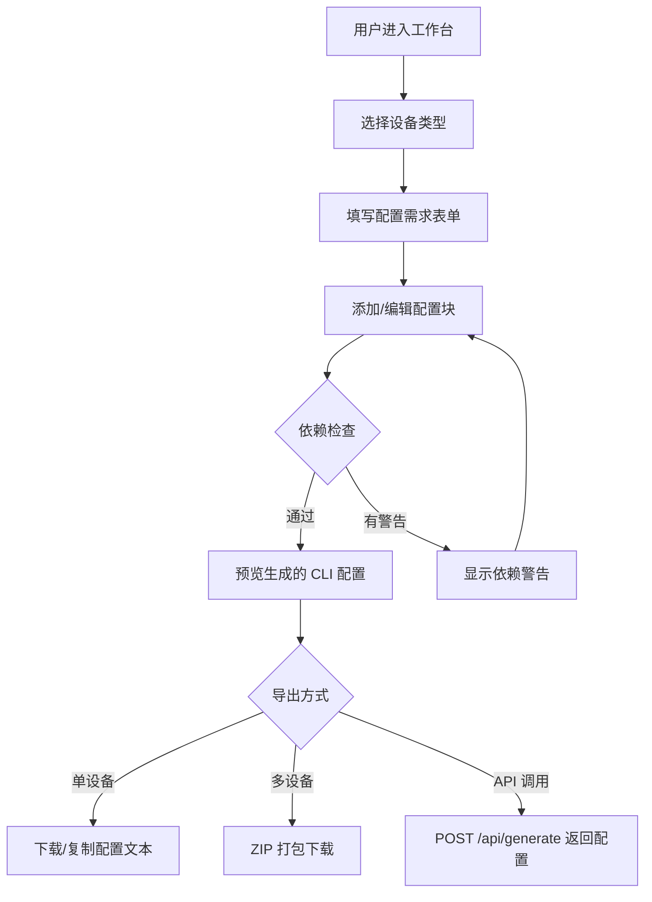

## 1. 产品概述

多协议网络配置生成器是一个面向网络工程师的 Web 工具，通过可视化表单输入网络需求，自动生成 Cisco 路由器、华为交换机、Linux 服务器和 Windows 防火墙的 CLI 配置文件。解决手动编写网络配置耗时且易出错的问题，目标用户为网络运维工程师和 IT 基础设施管理人员。

## 2. 核心功能

### 2.1 用户角色

| 角色 | 描述 | 核心权限 |
|------|------|----------|
| 普通用户 | 网络工程师 | 选择设备类型、填写配置需求、预览/下载配置、导入模板、版本对比 |

### 2.2 功能模块

1. **设备配置工作台**：设备类型选择、配置需求表单、配置块管理、实时预览
2. **配置模板管理**：内置 Jinja2 模板、用户上传自定义模板
3. **配置导出**：单设备配置文本复制/下载、多设备 ZIP 打包下载
4. **版本对比**：新旧配置差异报告（diff 视图）
5. **API 服务**：REST API 提交配置请求，返回生成的配置文本

### 2.3 页面详情

| 页面名称 | 模块名称 | 功能描述 |
|----------|----------|----------|
| 配置工作台 | 设备类型选择器 | 卡片式选择 Cisco 路由器、华为交换机、Linux 服务器、Windows 防火墙 |
| 配置工作台 | 配置需求表单 | 动态表单，根据设备类型显示不同配置项：接口 IP、静态路由、VLAN、ACL 等 |
| 配置工作台 | 配置块管理器 | 支持添加/删除/复制/粘贴配置块，批量配置多个接口 |
| 配置工作台 | 实时预览面板 | 语法高亮的 CLI 配置预览，实时更新 |
| 配置工作台 | 依赖检查面板 | 自动检测未创建的 VLAN 引用、接口引用等依赖问题，显示警告 |
| 配置工作台 | 导出操作栏 | 单设备下载、多设备 ZIP 打包、复制到剪贴板 |
| 模板管理 | 内置模板列表 | 展示四种设备类型的内置 Jinja2 模板 |
| 模板管理 | 模板上传 | 用户上传自定义 .j2 模板文件，关联设备类型 |
| 版本对比 | Diff 视图 | 并排或统一格式展示新旧配置的差异，高亮增删改行 |

## 3. 核心流程

用户进入配置工作台 → 选择设备类型 → 填写配置需求表单（添加配置块） → 系统实时预览生成的 CLI 配置（带语法高亮） → 依赖检查自动运行，显示警告 → 用户调整配置 → 导出配置（单文件/多设备 ZIP）或通过 API 获取配置文本。

## 4. 用户界面设计

### 4.1 设计风格

- **色调**：深色科技风主题，主色为深蓝灰（#0f172a）背景，强调色为霓虹青（#06d6a0）和电光蓝（#3b82f6），用于按钮和高亮
- **字体**：标题使用 JetBrains Mono 等宽字体体现技术感，正文使用 Noto Sans SC
- **按钮**：扁平化设计，带微妙的 hover 发光效果（box-shadow glow）
- **布局**：左侧配置面板 + 右侧实时预览的经典工作台布局，顶部导航栏
- **图标**：使用 Lucide Icons 系列

### 4.2 页面设计概览

| 页面名称 | 模块名称 | UI 元素 |
|----------|----------|---------|
| 配置工作台 | 设备选择器 | 4 张设备卡片，带图标和名称，选中态高亮边框 + 发光效果 |
| 配置工作台 | 需求表单 | 分段表单，每段可折叠，支持下拉选择 + 文本输入 + 开关切换 |
| 配置工作台 | 配置块管理 | 可拖拽排序的配置块卡片，每个卡片有复制/粘贴/删除按钮 |
| 配置工作台 | 实时预览 | 代码编辑区风格，monospace 字体，CLI 关键字语法高亮 |
| 配置工作台 | 依赖警告 | 顶部黄色/红色警告条，列出具体依赖问题 |
| 模板管理 | 模板列表 | 表格/卡片混合布局，显示模板名、设备类型、更新时间 |
| 模板管理 | 上传区域 | 拖拽上传区，支持 .j2 文件 |
| 版本对比 | Diff 视图 | 双栏并排对比，绿色背景表示新增，红色背景表示删除 |

### 4.3 响应式设计

- 桌面优先设计，最小支持 1280px 宽度
- 平板端（768px）预览面板切换为标签页显示
- 移动端（< 768px）配置表单全宽堆叠，预览面板可折叠

## 5. 非功能需求

- 配置生成响应时间 < 500ms
- 支持同时处理 50+ 个配置块的表单
- 模板解析使用沙箱环境，防止 Jinja2 模板注入攻击
- API 支持 JSON 请求体，返回纯文本或 JSON 格式