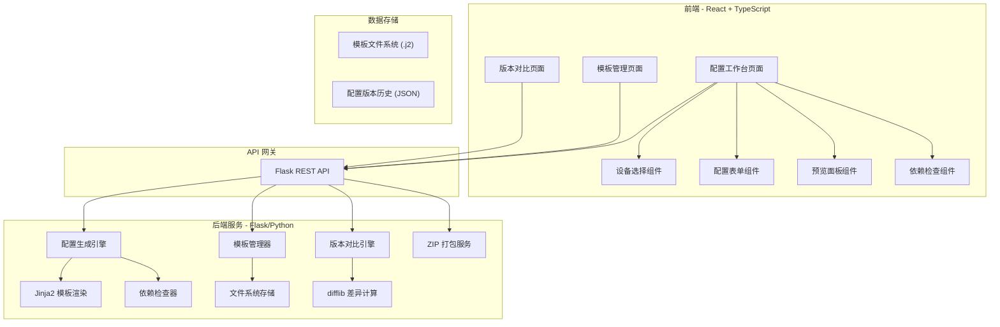
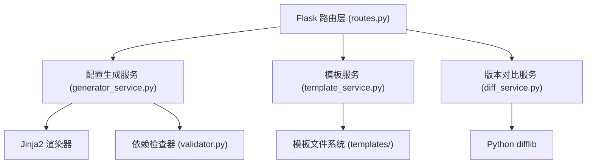

## 1. 架构设计



## 2. 技术选型

| 层级 | 技术 | 版本 | 说明 |
|------|------|------|------|
| 前端框架 | React + TypeScript | 18.x | SPA 应用，使用 Vite 构建 |
| 样式方案 | Tailwind CSS | 3.x | 原子化 CSS |
| 状态管理 | Zustand | 4.x | 轻量级状态管理 |
| 图标 | Lucide React | latest | 开源图标库 |
| 语法高亮 | Prism.js | latest | CLI 配置语法高亮 |
| Diff 视图 | diff + 自定义组件 | - | 配置差异对比 |
| 后端框架 | Flask | 3.x | Python Web 框架 |
| 模板引擎 | Jinja2 | 3.x | 配置文件模板渲染 |
| 配置校验 | Pydantic | 2.x | 请求数据校验 |
| CORS | Flask-CORS | latest | 跨域支持 |
| ZIP 打包 | Python zipfile | 内置 | 多设备配置打包 |
| Diff 计算 | Python difflib | 内置 | 版本差异计算 |

## 3. 路由定义

### 前端路由

| 路由 | 页面 | 说明 |
|------|------|------|
| `/` | 配置工作台 | 主页面，设备选择 + 配置表单 + 预览 |
| `/templates` | 模板管理 | 内置模板列表 + 上传自定义模板 |
| `/diff` | 版本对比 | 配置版本差异对比 |

### 后端 API

| 方法 | 路由 | 说明 |
|------|------|------|
| `GET` | `/api/device-types` | 获取支持的设备类型列表 |
| `GET` | `/api/templates` | 获取所有可用模板 |
| `GET` | `/api/templates/:id` | 获取指定模板内容 |
| `POST` | `/api/templates/upload` | 上传自定义模板 |
| `POST` | `/api/generate` | 提交配置请求，生成配置文本 |
| `POST` | `/api/generate/zip` | 批量生成配置并打包 ZIP |
| `POST` | `/api/diff` | 对比两个配置文本的差异 |
| `POST` | `/api/validate` | 依赖检查，返回警告列表 |

## 4. API 定义

### POST /api/generate

```typescript
// 请求体
interface GenerateRequest {
  device_type: 'cisco_router' | 'huawei_switch' | 'linux_server' | 'windows_firewall';
  template_id?: string;
  config_blocks: ConfigBlock[];
}

interface ConfigBlock {
  type: 'interface' | 'static_route' | 'vlan' | 'acl' | 'ospf' | 'bgp' | 'dhcp' | 'dns' | 'hostname' | 'ntp' | 'snmp';
  id: string;
  properties: Record<string, string | number | boolean>;
}

// 响应
interface GenerateResponse {
  success: boolean;
  config_text: string;
  warnings: ValidationWarning[];
  template_used: string;
}

interface ValidationWarning {
  type: 'missing_vlan' | 'missing_interface' | 'ip_conflict' | 'unknown';
  message: string;
  block_id?: string;
}
```

### POST /api/diff

```typescript
interface DiffRequest {
  old_config: string;
  new_config: string;
}

interface DiffResponse {
  diff_lines: DiffLine[];
  stats: { added: number; removed: number; unchanged: number };
}

interface DiffLine {
  type: 'added' | 'removed' | 'unchanged';
  content: string;
  line_number_old?: number;
  line_number_new?: number;
}
```

## 5. 服务端架构



## 6. 数据模型

### 6.1 模板文件结构

```
server/
├── templates/
│   ├── cisco_router/
│   │   └── default.j2
│   ├── huawei_switch/
│   │   └── default.j2
│   ├── linux_server/
│   │   └── default.j2
│   └── windows_firewall/
│       └── default.j2
├── user_templates/
│   └── {uploaded .j2 files}
└── config_history/
    └── {timestamp}.json
```

### 6.2 配置历史 JSON 结构

```json
{
  "id": "uuid",
  "device_type": "cisco_router",
  "config_text": "...",
  "config_blocks": [...],
  "created_at": "ISO8601",
  "version": 1
}
```